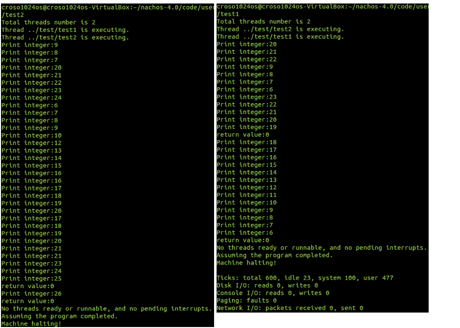
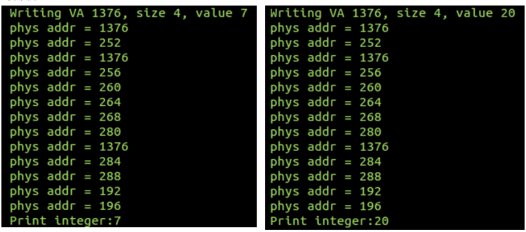
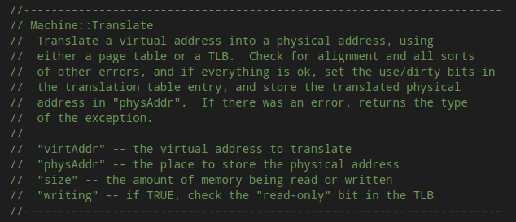
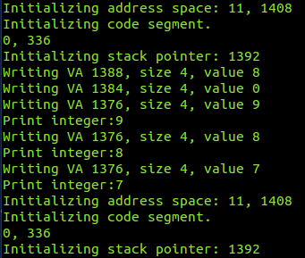
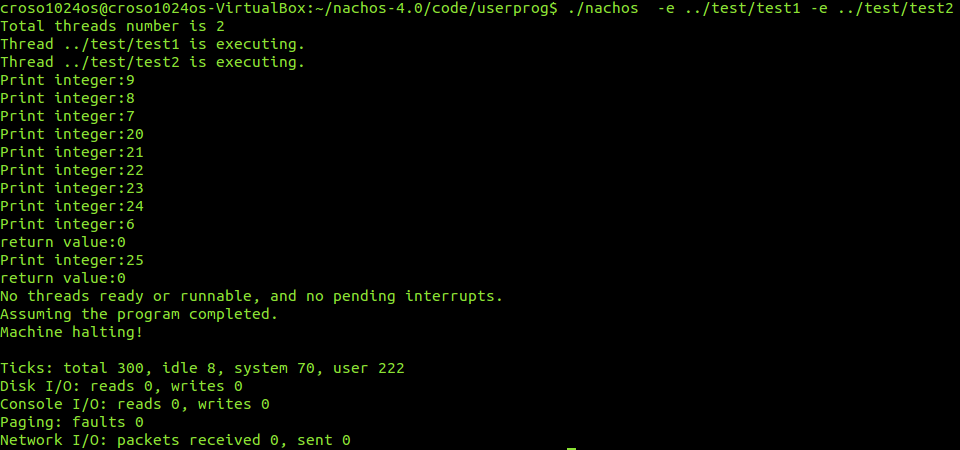
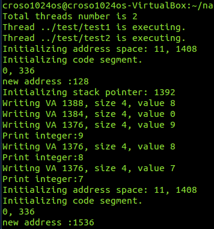
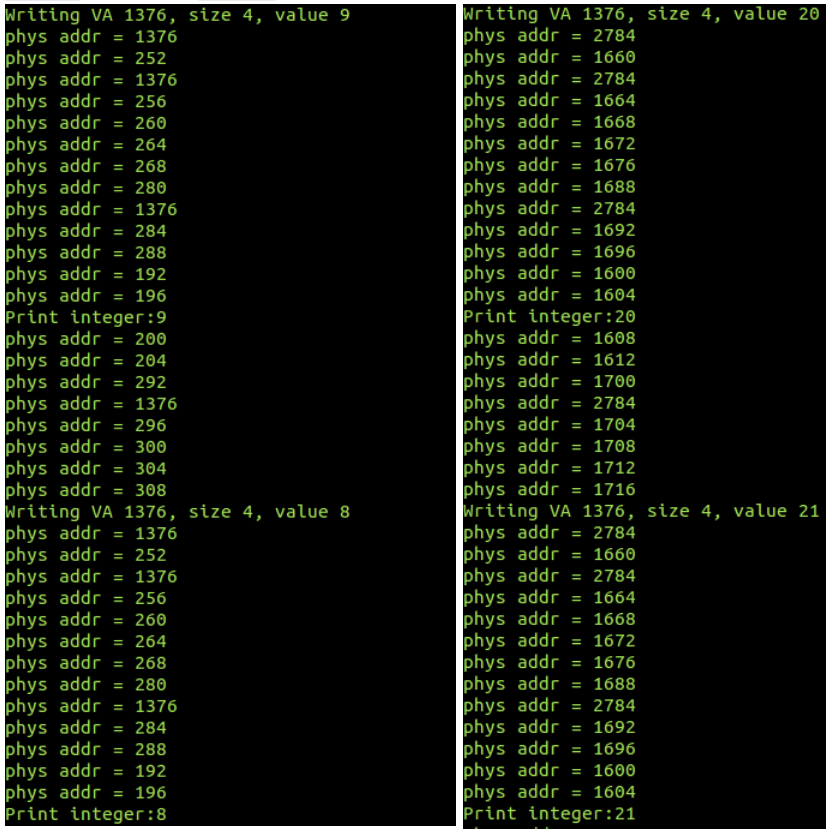

## OS Project1 Report 
<strong>r10522846 機械所 李明峰 </strong> 

#### Why the result is not congruent with expected ?  
一開始我先嘗試依照投影片方式在虛擬機終端執行 `test1.c` 與 `test2.c`  , 出現和Slide中相同的錯誤 , 終端打印出來的數字由 `test1.c` 所賦的9開始遞減,但在 `test2.c` 開始執行的時候就像是被覆蓋掉一樣由 `test2.c` 內賦值的20開始打印
從` ./nachos4.0/code/test/ `下去看`test1.c`和`test2.c` 

```c
// test1.c
#include "syscall.h"
main() {
	int n ; 
	for (n=9 ; n>5 ; n-- ) 
		PrintInt(n) ; 
}
// test2.c
#include "syscall.h"
main() {
	int n ; 
	for (n=20 ; n<=25 ; n++ ) 
		PrintInt(n) ; 
}
```

在左圖可以看到自 `test2.c` 執行打印出20後 , for 迴圈內的迴圈停止條件和變數控制都像是被 `test2.c` 內所宣告的覆蓋掉了 , 為了測試所以也更換一下執行的順序 ,改為先執行 `test2.c` 再接著執行 `test1.c` ,結果如下右圖 
可以看到相似的結果 , 由 `test2.c`所初始化的20開始依照迴圈控制變數遞增, 直到 `test1.c` 部份開始執行 , 此時迴圈的結束條件與變數控制又變得和後來執行的那一支程式一樣 . 
到這邊我原本的推測是多線程執行時可能會遇到到類似race condition那樣的問題, 兩個程式同時存取一個變數導致結果異常 . 

在終端機執行的命令加上-d顯示DEBUG訊息後, 擷取先執行`test1.c`再執行`test2.c` 當中由Print 7 轉到Print 20的部份 : 

在`code/machine/translate.cc`中找到了phys addr的DEBUG訊息來源  , 依據裡面Translate方法的註解
 
大致上可以看出這個函數應該是將virtual address轉到physical address  , 這邊雖然我沒有很清楚每一個Print與Writing間每一步多次的轉換成phys addr各自所對應程式碼中的哪一部分 , 但仍然可以觀察到兩邊最終使用到的physical address是一模一樣 , 代表執行過程中所有相關變數與條件的儲存可能都使用了相同的地方 , 造成在同時執行的時候發生的錯誤 . 

#### How to solve the issue  
依據助教的提示在`addrspace.cc`中找到了裡面有包含virtual address的資訊 
```c
// then, copy in the code and data segments into memory
	if (noffH.code.size > 0) {
        DEBUG(dbgAddr, "Initializing code segment.");
	DEBUG(dbgAddr, noffH.code.virtualAddr << ", " << noffH.code.size);
        	executable->ReadAt(
		&(kernel->machine->mainMemory[noffH.code.virtualAddr]), 
			noffH.code.size, noffH.code.inFileAddr);
    }
	if (noffH.initData.size > 0) {
        DEBUG(dbgAddr, "Initializing data segment.");
	DEBUG(dbgAddr, noffH.initData.virtualAddr << ", " << noffH.initData.size);
        executable->ReadAt(
		&(kernel->machine->mainMemory[noffH.initData.virtualAddr]),
			noffH.initData.size, noffH.initData.inFileAddr);
    }
 
```

回到前面的DEBUG訊息中 , 把phys addr先註解掉避免終端機的訊息被刷掉來看上面那段程式碼顯示的訊息 

看起來兩次的virtual address是一樣的 , 所以在上面的translate中會得到一樣的physical address . 這邊參考網路上的做法, 可以在AddrSpace中加入對於page使用狀態的追蹤， 
在`addrspace.h`中的AddrSpace加入代表physical page是否使用的phyPageState 和可用physical page的availablePages . 

```c
class AddrSpace {
  public:
    AddrSpace();			// Create an address space.
    ~AddrSpace();			// De-allocate an address space

    void Execute(char *fileName);	// Run the the program
					// stored in the file "executable"

    void SaveState();			// Save/restore address space-specific
    void RestoreState();		// info on a context switch 

    static bool phyPageState[NumPhysPages] ; 
    static unsigned int availablePages ;  

  private:
    TranslationEntry *pageTable;	// Assume linear page table translation
					// for now!
    unsigned int numPages;		// Number of pages in the virtual 
					// address space

    bool Load(char *fileName);		// Load the program into memory
					// return false if not found

    void InitRegisters();		// Initialize user-level CPU registers,
					// before jumping to user code

};
```
在`addrspace.cc` 中在開頭宣告這兩個變數分別為false代表全都未使用以及一開始的有的physical page數量. 
```c

bool AddrSpace::phyPageState[NumPhysPages] = {true} ;  
unsigned int AddrSpace::availablePages = NumPhysPages ; 
```
接下來動到從file將程式讀進memory的區段 , 利用迴圈一個一個尋找可用的physical address , 將原始程式碼中code segment的部份修改 , 而data segment的部份也做類似的修正 
```c
executable->ReadAt(
		&(kernel->machine->mainMemory[noffH.code.virturalAddr]) , 
			noffH.code.size , noffH.code.inFileAddr);
	)
```
把原先使用的virtual address換成剛剛建表維護的physical page , 
```c
// noffHcode.virturalAddr / PageSize 找出我們的程式在virtual address中屬於第幾頁
// 將這個頁數作為pageTable的index來取得physical address.
// 剩餘的offset則加上noffH.code.virturalAddr % PageSize 
executable->ReadAt(
		&(kernel->machine->mainMemory[
            pageTable[noffH.code.virtualAddr / PageSize].physicalPage * PageSize + (noffH.code.virtualAddr % PageSize )
        ]) , 
			noffH.code.size , noffH.code.inFileAddr);
	)
```
```c
   unsigned int idx = 0  ;
    unsigned int phyPageId = 0 ; 
    for (; idx < numPages; idx+=1 )
    {
        while( (phyPageId<NumPhysPages) && (AddrSpace::phyPageState[phyPageId] == true )) {phyPageId += 1;}
        AddrSpace::phyPageState[phyPageId] = true ;  
        AddrSpace::availablePages--;  
        bzero( &(kernel->machine->mainMemory[phyPageId*PageSize])  ,PageSize );
        pageTable[idx].physicalPage = phyPageId ; 
        pageTable[idx].use = false ; 
        pageTable[idx].valid = true ;
    }


    if (noffH.code.size>0) 
    {
       DEBUG(dbgAddr, "Initializing code segment.");
       DEBUG(dbgAddr, noffH.code.virtualAddr << ", " << noffH.code.size);
       executable->ReadAt(
           &(kernel->machine->mainMemory[
               pageTable[noffH.code.virtualAddr / PageSize].physicalPage*PageSize + (noffH.code.virtualAddr % PageSize) 
           ]) , noffH.code.size , noffH.code.inFileAddr  
       );
       DEBUG(dbgAddr , "new address :" << pageTable[noffH.code.virtualAddr / PageSize].physicalPage*PageSize + (noffH.code.virtualAddr % PageSize) )
    }

    if (noffH.initData.size > 0) 
    {
        DEBUG(dbgAddr, "Initializing data segment.");
        DEBUG(dbgAddr, noffH.initData.virtualAddr << ", " << noffH.initData.size);
        executable->ReadAt(
             &(kernel->machine->mainMemory[
                 pageTable[noffH.initData.virtualAddr/PageSize].physicalPage*PageSize + (noffH.initData.virtualAddr % PageSize )
             ]), noffH.initData.size , noffH.initData.inFileAddr 
        );
    }

```

最後在執行結束時 ,要同步修改我們維護的page使用狀態 
```c
AddrSpace::~AddrSpace()
{
   
    unsigned int i = 0 ; 
    for ( i=0 ; i < numPages ; i+= 1 ) 
    {
        AddrSpace::phyPageState[pageTable[i].physicalPage] = false ; 
        AddrSpace::availablePages += 1 ; 
    }
    
    delete pageTable;
}

```
#### Experiment result 

做完上述修改後, 先關掉DEBUG訊息檢查原先的輸出結果是不是正常


在原先code segment的DEBUG訊息我再嘗試加入剛剛修改後的 `pageTable[noffH.code.virtualAddr / PageSize].physicalPage * PageSize + (noffH.code.virtualAddr % PageSize )`  , 來看看

原先重疊的noffH.code.virturalAddr分別由0 變成128與1536
可以看到這邊執行的結果已經符合我們的預期 , 再從上面檢查過得phys addr來看是否還有位置相同的問題 , 屬於`test1.c`的部份已經和`test2.c`的部份分到不同的physical address了



#### Discuss
這次作業在完成過程中有遭遇幾個小問題  , 一開始是當我嘗試用
`./nachos -d a -e ..... ` 執行帶有DEBUG訊息的測試程式時 , 因為終端機的長度關係一直沒辦法看到同時執行兩個測試程式時的在一開始Initiali的部份 , 一開始我是想先把會佔掉大部分終端機訊息的phys addr關閉 , 但為了尋找它出現的地方也需要花一些心力 , 尤其在一開始裡面我直接使用vim的情況有些對眼睛不太友好 

後來google找到透過`grep -r` 來搜目錄下的符合內容才順利找到 , 而後來也有google到透過script -f output.txt來將終端機訊息寫入檔案的方式來擷取完成訊息 . 到這邊才順利完成一開始的問題檢查 . 
