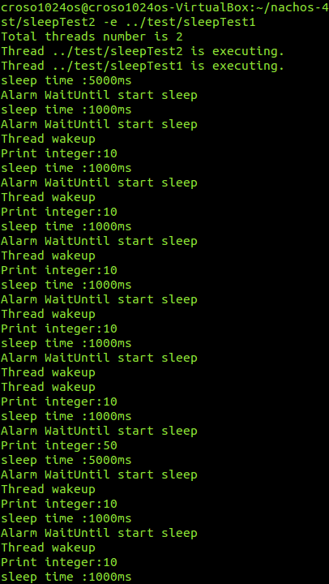
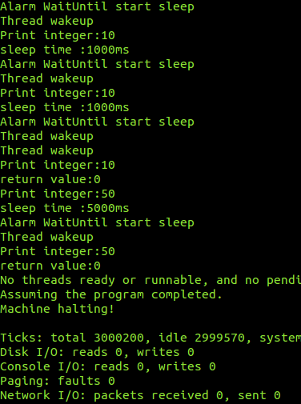
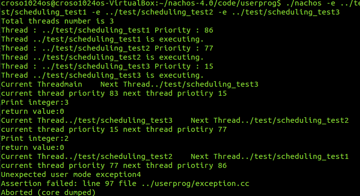
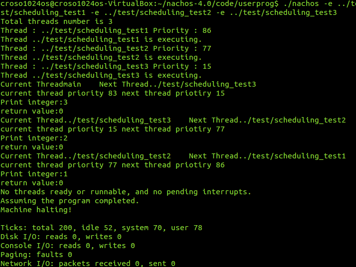

# OS Project 2  Report 
<strong>r10522846 機械所 李明峰</strong>
## Motivation
本次作業的目標是實現Sleep的系統呼叫 , 以及至少一種在課程內容中所帶到的CPU scheduling algorithms , 在`/nachos/code/userprog/syscall.h`中可以看到有一些已經定義好的syscall , 因此這次Sleep()的實現一部分也參考了前一次作業中用到的PrintInt()    

另一部份的cpu scheduling 我嘗試的是Priority Scheduling , 從講義的內容大概可以了解Shortest-Job-First算是priority schedule 的一種case ,只是將burst拿來當作判斷priority的依據  , 另外一點則是在測試時,我想透過隨機指派各process的priority , 可以比較簡單的就觀察到我們的實現是不是運作正常的。 
## Implementation
### 1.  syscall Sleep() 
和前面提到的一樣, 這邊參考`PrintInt`的部份作法 , 先在`/code/userprog/syscall.h`內加入我們的Sleep()的定義 ,加入`SC_Sleep 12` 並定義Sleep的函數
``` h 
/* system call codes -- used by the stubs to tell the kernel which system call
 * is being asked for
 */
#define SC_Halt		0
#define SC_Exit		1
#define SC_Exec		2
#define SC_Join		3
#define SC_Create	4
#define SC_Open		5
#define SC_Read		6
#define SC_Write	7
#define SC_Close	8
#define SC_ThreadFork	9
#define SC_ThreadYield	10
#define SC_PrintInt	11
#define SC_Sleep 12 
```
``` h
void ThreadYield();		

void PrintInt(int number);
void Sleep(int number) ; // add Sleep  
#endif /* IN_ASM */

#endif /* SYSCALL_H */
```

在`/code/test/start.s`裡面有能看到有其他syscall的內容, 這邊就照樣把Sleep()加進去
``` s
	.globl  PrintInt
	.ent    PrintInt
PrintInt:
	addiu   $2,$0,SC_PrintInt
	syscall
	j       $31
	.end    PrintInt

	.globl Sleep 
	.ent   Sleep
Sleep : 
	addiu $2,$0,SC_Sleep 
	syscall 
	j      $31 
	.end Sleep 

```
接著是Sleep()功能的內容 , 在`/code/threads/alarm.h`內就有找到關於計時器的描述, 提供thread在一定延遲後醒來 , 裡面有一個`WaitUntil`的函數從註解看就能大概知道可以幫我們實現Sleep()的功能  , 參考前人的作法,我們會需要建立一個放置Sleep thread的序列 ,其介面包含放入與取出 , 所以在 `/code/threads/alarm.h`內我們定義`Sleep_pool` , 並且加到原有的`Alarm`下 
``` h
#include "thread.h" 
#include <list> 

class Sleep_pool 
{
    public: 
        Sleep_pool():_current_interrupt(0) {}; 
        void add2sleep(Thread *t , int x) ; 
      bool wakeup() ; 
      bool pool_empty(); 
    private:  
      class Sleep_thread 
      {
        public : 
          Sleep_thread(Thread *t , int x ) : 
          sleep(t) , when(x) {} ; 
          Thread *sleep ; 
          int when  ; 
      };
    int _current_interrupt ; 
    std::list<Sleep_thread> _Sleep_pool ; 
} ; 
// The following class defines a software alarm clock. 
class Alarm : public CallBackObj {
  public:
    Alarm(bool doRandomYield);	// Initialize the timer, and callback 
				// to "toCall" every time slice.
    ~Alarm() { delete timer; }
   
    void WaitUntil(int x);	// suspend execution until time > now + x
  private:
    Timer *timer;		// the hardware timer device
    Sleep_pool  _Sleep_pool ; 
    void CallBack();		// called when the hardware
				// timer generates an interrupt
};

#endif // ALARM_H
```
我們在`/code/threads/alarm.cc`內要完成

``` c

void Alarm::WaitUntil( int x ) 
{
    IntStatus previous_level = kernel->interrupt->SetLevel(IntOff) ;
    Thread* t = kernel->currentThread ; 
    cout << "Alarm WaitUntil start sleep " << endl ; 
    _Sleep_pool.add2sleep(t,x)    ; 
    kernel->interrupt->SetLevel(previous_level) ; 
}

void Sleep_pool::add2sleep(Thread *t, int x ) 
{
    ASSERT(kernel ->interrupt->getLevel() == IntOff ) ; 
    _Sleep_pool.push_back( Sleep_thread(t , _current_interrupt + x )) ; 
    t -> Sleep(false) ; 
} 

bool Sleep_pool::pool_empty() 
{
    return _Sleep_pool.size() == 0 ; 
} 


bool Sleep_pool::wakeup() 
{
    bool wake = false ; 
    _current_interrupt ++ ; 
    for( std::list<Sleep_thread>::iterator iter = _Sleep_pool.begin() ; iter != _Sleep_pool.end(); )
    {
        if (_current_interrupt >= iter->when) 
        {
            wake = true ; 
            cout << "Thread wakeup" << endl ; 
            kernel -> scheduler -> ReadyToRun(iter->sleep) ; 
            iter = _Sleep_pool.erase(iter) ; 
        }
        else 
        {
            iter ++ ; 
        }
    }
    return wake ; 
}
```
原先的`Alarm::CallBack()`我們需要去增加檢查有沒有哪個在`Sleep_pool`內的thread要起來 , 
``` cc
void 
Alarm::CallBack() 
{
    Interrupt *interrupt = kernel->interrupt;
    MachineStatus status = interrupt->getStatus();
 
    bool wake = _Sleep_pool.wakeup() ; 
    if (status == IdleMode && !wake && _Sleep_pool.pool_empty()) 
    {	// is it time to quit?
        if (!interrupt->AnyFutureInterrupts()) 
        {
	    timer->Disable();	// turn off the timer
	    }
    } 
    else 
    {			// there's someone to preempt
        interrupt->YieldOnReturn();   
    }
}
```
修改完`Alarm.h` , `Alarm.cc`後 , 找到`/code/userprog/exception.cc` ,這邊的註解就有告訴我們這是user program進入Nachos kernel的地方  
``` c
// exception.cc 
//	Entry point into the Nachos kernel from user programs.
//	There are two kinds of things that can cause control to
//	transfer back to here from user code:
//
//	syscall -- The user code explicitly requests to call a procedure
//	in the Nachos kernel.  Right now, the only function we support is
//	"Halt".
//
//	exceptions -- The user code does something that the CPU can't handle.
//	For instance, accessing memory that doesn't exist, arithmetic errors,
//	etc.  

```
``` c
		case SC_PrintInt:
			val=kernel->machine->ReadRegister(4);
			cout << "Print integer:" <<val << endl;
			return;

		case SC_Sleep:
			val=kernel -> machine ->ReadRegister(4);
			cout << "sleep time :" <<val << "ms" << endl;
			kernel->alarm->WaitUntil(val) ; 
			return;
```
在裡面找到 `SC_PrintInt` 的case ,一樣把我們的Sleep()加進去 , 希望在呼叫Sleep()後去執行`WaitUntil` 到此syscall Sleep的部份應該就差不多了 

### 2. CPU Scheduling 
這邊要實做的排程方式是Priority scheduling  , scheduler會從ready queue中選出最高優先度的thread來執行 , 先在`/code/threads/thread.h`為Thread中加入priority的屬性, 因為待會我們想直接使用隨機分配priority的方式來方便我們進行測試 ,因此也在`/code/threads/thread.cc`內加入隨機產生的priority
``` h 
// thread.h
class Thread {
  private:
    
    // NOTE: DO NOT CHANGE the order of these first two members.
    // THEY MUST be in this position for SWITCH to work.
    int *stackTop;			 // the current stack pointer
    void *machineState[MachineStateSize];  // all registers except for stackTop
    // add 11-15 
    int priority ; 
    
  public:
    int getPriority() {return priority ; }
```

``` cc
// thread.cc
Thread::Thread(char* threadName)
{
    name = threadName;
    stackTop = NULL;
    stack = NULL;

    // add 11-15 
    priority = (rand()%100) ;

    status = JUST_CREATED;
    for (int i = 0; i < MachineStateSize; i++) {
	machineState[i] = NULL;		// not strictly necessary, since
					// new thread ignores contents 
					// of machine registers
    }
#ifdef USER_PROGRAM
    space = NULL;
#endif
}


```
因為要排序每一個thread的priority , 因此把`/code/threads/scheduler.h`中定義的readyList改為SortedList ,並且在` /code/threads/scheduler.cc`中定義比較兩個thread priority的方式 ,並建立Scheduler內的readyList 
``` h
// scheduler.h
class Scheduler {
  public:
	...
	...
	...
  private:
	SchedulerType schedulerType;
	//List<Thread *> *readyList;	// queue of threads that are ready to run,// but not running
	SortedList<Thread *> *readyList ; 
	Thread *toBeDestroyed;		// finishing thread to be destroyed
    					// by the next thread that runs
};
```

``` cc 
// scheduler.cc 
int cmp(Thread *a , Thread *b ) 
{
    if (a->getPriority() < b->getPriority()) {return -1;}
    else {return 0;}

}
Scheduler::Scheduler()
{
//	schedulerType = type;
	// add 11-15 
    //readyList = new List<Thread *>; 
    readyList = new SortedList<Thread *>(cmp) ; 


	toBeDestroyed = NULL;
} 
```
由於我們把原先的readyList從List改為SortedList , 因此在`Scheduler::ReadyToRun` 裡面將thread加入readyList的部份也要修改一下 
``` cc
// scheduler.cc 
void Scheduler::ReadyToRun (Thread *thread)
{
	...
    ...
	...
    readyList->Insert(thread) ; 
}
```


## Result 

在測試結果的部份, 先是Sleep的 test code ,兩支測試程式分別是等待1000和5000單位時間,並且個別執行等待10次與3次, 預期上的結果應該是`sleepTest2.c`顯示的10會穿插5次在`sleepTest1.c`所打印的50之中 ,最後多執行一次打印50  
``` c
// sleepTest1.c 
#include "syscall.h" 

main() 
{
    int i ; 

    for( i = 0 ; i < 3 ; i++ ) {
        Sleep(5000);
        PrintInt(50) ; 

    }
    return 0 ; 
}
//////////////////////////////////////////
// sleepTest2.c 
#include "syscall.h" 

main() 
{
    int i ; 

    for( i = 0 ; i < 10 ; i++ ) {
        Sleep(1000);
        PrintInt(10) ; 

    }
    return 0 ; 
}
```
這邊在`~/nachos-4.0/code/userprog`下執行
`./nachos -e ../test/sleepTest2 -e ../test/sleepTest1`  其結果符合預期如下圖 
<span> </span>


而CPU scheduling的測試 ,因為上面提到是讓thread隨機被分到一個priority ,因此test code這邊就很簡單 , 用了三個內容差不多的`scheduling_test1.c` , `scheduling_test2.c` ,`scheduling_test3.c` 其內容只是打印自己的編號 
``` c
//scheduling_test1.c
#include "syscall.h" 
void main() 
{
    int n = 1 ; 
    PrintInt(n);
}
//scheduling_test2.c
#include "syscall.h" 
void main() 
{
    int n = 2 ; 
    PrintInt(n);
}
//scheduling_test3.c
#include "syscall.h" 
void main() 
{
    int n = 3 ; 
    PrintInt(n);
}
```

不過這邊遇到了一個新的問題 ,在執行測試時會遇到這個`aborted (core dumped)` , 但如果只執行了兩個test code時並不會發生 .


google一下後看到wiki的說法有提到或許是cpu嘗試存取不存在的記憶體區段 , 這邊我猜和前一次作業的內容有些關聯, 不過解決的方式是直接到 `/code/machine/machine.h`內增加物理記憶體的大小
``` h
// machine.h 
const unsigned int PageSize = 128; 	
```

修改完後一樣在`~/nachos-4.0/code/userprog`下執行 
`./nachos -e ../test/scheduling_test1 -e ../test/scheduling_test2 -e ../test/scheduling_test3` 
結果如下圖

從結果上可以看到確實是由priority順序最前的15開始 ,依照15 - 77 -86的順序執行並打印出對應數字

第二個test case我打算直接使用前面做的Sleep , 利用相同的`sleepTest1.c`與`sleepTest2.c` 
可以預期表現還是會和前面在測試sleep時相同 


